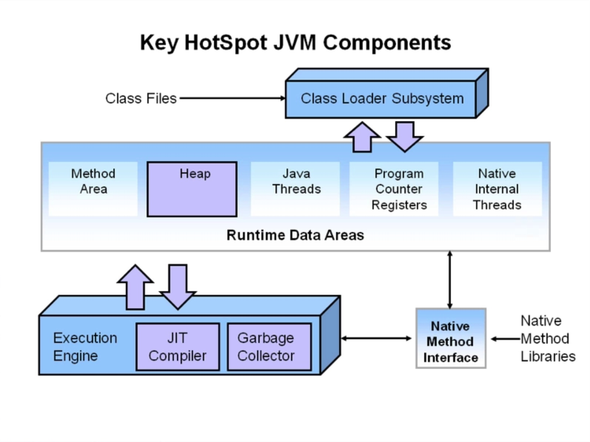
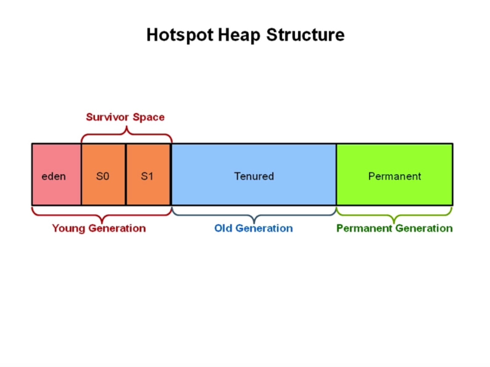
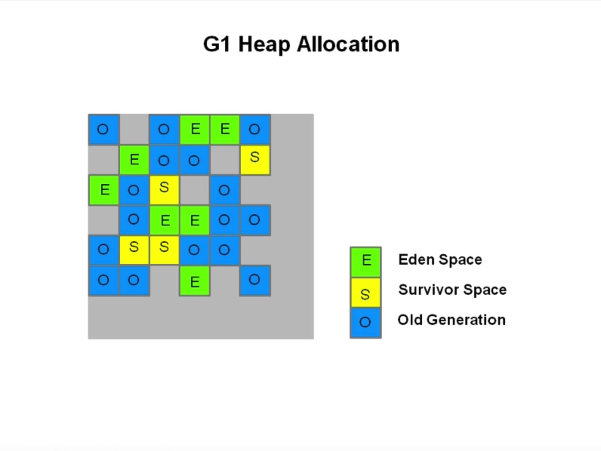
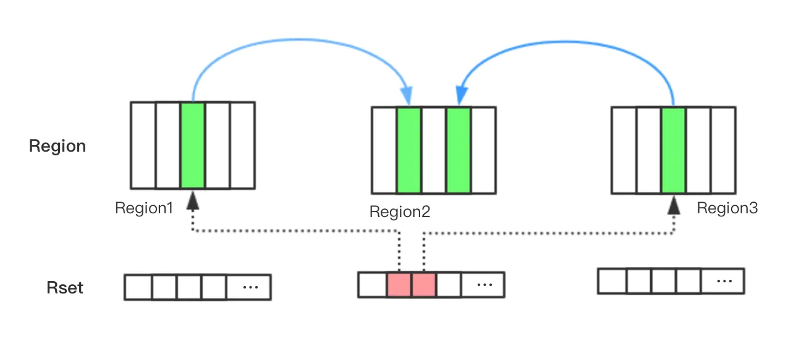

# jvm 笔记
## G1垃圾回收器
### 一、G1出现的契机
#### 1、吞吐量
- 吞吐量关注的是，在一个指定的时间内，最大化应用的工作量。
- 如下方式来衡量一个系统吞吐量的好坏
 - 在一小时内同一个事务（或者任务、请求）完成的次数（tps）
 - 数据库一小时可以完成多少次查询
- 对于关注吞吐量的系统，卡顿是可以接受的，因为这个系统关注长时间的大量任务的执行能力单次快速的响应并不值得考虑。

#### 2、 响应能力
- 响应能力指一个程序或者系统对请求是否能够及时响应，比如:
 - 一个桌面UI能多快地响应一个事件
 - 一个网站能够多快返回
 - 一个页面请求数据库能够多快返回查询的数据
- 对于这类对响应能力敏感的场景，长时间的停顿是无法接受的

#### 3、G1概念
- G1 收集器是一个面向服务端的垃圾收集器，适用于多核处理器、大内存容量的服务端。
- 它满足短时间 gc 停顿的同时达到一个较高的吞吐量。
- JDK7 以上版本适用。

#### 4、G1 收集器的设计目标
- 与应用线程同时工作，几乎不需要 stop the Word（与 CMS 类似）；
- 整理剩余空间，不产生内存碎片（CMS 只能在 Ful GC 时，用 stop the world 整理内存碎片 
- GC 停顿更加可控
- 不牺牲系统的吞吐量
- gc 不要求额外的内存空间（CMS 需要预留空间存储**浮动垃圾**）

#### 5、 G1 的设计规划是要替换掉 CMS

- G1 在某些方面弥补了 CMS 的不足，比如 CMS 使用的是 **mark-sweep**算法，自然会产生内存碎片；然而G1基于 **copying** 算法，高效的整理剩余内存，而不需要管理内存碎片。
- 另外，G1 提供了更多手段，以达到对 gc 停顿时间的可控。

### 二、G1堆空间结构
#### 1、hotspot 虚拟机构成

#### 2、传统垃圾收集器堆机构

#### 3、G1收集器堆结构

- Heap 被划分为一个个相等的不连续的内存区域（regions），每个 region 都有代的角色：eden、survor、old
- 对每个角色的数量并没有强制的限定，也就是说对每种分代内存的大小，可以动态变化
- G1 最大的特点就是高效的执行回收，优先去执行那些大量对象可回收的区域（region)
- G1 使用了 gc 停顿可预测的模型，来满足用户设定的 gc 停顿时间，根据用户设定的目标时间，G1 会自动地选择哪些 region 要清除，一次清除多少个region
- G1 从多个 region 中复制存活的对象，然后集中放入一个 region 中，同时整理、清除内存（**copying 收集算法**）

#### 4、G1 vs CMS
- 对比使用 mark-sweep 的 CMS, G1 使用的 copying 算法**不会造成内存碎片**;
- 对比 Parallel Scavenge（基于copying) Parallel Old 收集器（基于 mark-compact-sweep), Parallel 会对整个区域做整理**导致 gc 停顿会比较长**，而 G1 只是特定地整理几region；
- G1 并非一个实时的收集器，与 parallel Scavenge 一样，对 gc 停顿时间的设置并**不绝对生效**，只是 G1 有较高的几率保证不超过设定的 gc 停顿时间。与之前的 gc 收集器对比，G1 会根据用户设定的 gc 停顿时间智能评估哪几个 region 需要被回收可以满足用户的设定；

#### 5、G1重要的概念
- 分区（Region):
    - G1采取了不同的策略来解决并行、串行和 CMS 收集器的碎片、暂停时间不可控等问题，G1将**整个堆分**成相同大小的分区（Region)；
    - 每个分区都**可能是年轻代也可能是老年代**，但是在同一时刻只能属于某个代。年轻代、幸存区老年代这些概念还存在，成为**逻辑上的概念**，这样方便复用之前分代框架的逻辑。
    - 在物理上不需要连续，则带来了额外的好处有的分区内垃圾对象特别多，有的分区内垃圾对象很少，**G1 会优先回收垃圾对象特别多的分区**这样可以花费较少的时间来回收这些分区的垃圾这也就是 G1 名字的由来，即首先收集垃圾最多的
    - 依然是在新生代满了的时候，对整个新生代进行回收一一整个新生代中的对象，要么被回收、要么晋升，至于新生代也采取分区机制的原因，**则是因为这样跟老年代的策略统一，方便调整代的大小**
    - G1 还是一种带压缩的收集器，在回收老年代的分区时，是将存活的对象从一个分区拷贝到另一个可用分区，这个拷贝的过程就**实现了局部的压缩**。

- 收集集合(CSet）：
	- **一组可被回收的分区的集合**。在CSet中存活的数据会在GC过程中被移动到另一个可用分区，CSet中的分区可以来自**eden空间、survor空间或者老年代。**	   
- 已记忆集合（RSet): 
 - RSet 记录了**其他 Region 中的对象引用本 Region 中对象的关系**，属于 points-into？结构（谁引用了我的对象）。RSet 的价值在于使得垃圾收集器不需要扫描整个堆找到谁引用了当前分区中的对象，只需要扫描 RSet 即可。  
 - Region1 和 Region3 中的对象都引用了 Region2 中的对象，因此在 Region2 的 RSet 中记录了这两个引用。

- G1 GC 是在 points-out 的 card table 之上再加了一层结构来构成 points- into Rset：每个 region 会记录下到底哪些别的 region 有指向自己的指针，而这些指针分别在哪些 card 的范围内。
- 这个 RSet 其实是一个 hash table, key 是别的 Regions 的起始地址，value 是一个集合，里面的元素是 card tablel 的 Index。举例来说，如果 region A 的 RSet 里有一项的 key 是 region B value 里有index为1234的card，它的意思就是 region B的card 里有引用指向region A。所以对region A来说该RSet记录的是points-into的关系；而card table仍然记录points-out的关系。
- Snapshot-at-the-beginning (SATB) SATB 是 G1 GC 在**并发标记阶段**使用的**增量式**的标记算法。
- 并发标记是并发多线程的，但并发线程在同一时刻只扫描一个分区；

#### 6、G1 和 CMS 对比
- G1 在压缩空间方面有优势（cms标记清除，g1是copy算法）
- G1 通过将内存空间分成区域（Region）的方式避免内存碎片问题
- Eden、Survivor、Old 区不再固定，在内存使用效率上来说更灵活
- G1 可以通过设置预期停顿时间（Pause Time）来控制垃圾收集时间，避免应用雪崩现象
- G1 在回收内存后会马上同时做合并空闲内存的工作，而 CMS 默认是在 STW (stop the world）的时候做 G1 会在 Young GC 中使用，而 CMS 只能在 Old 区使用

#### 7、G1的适合场景
- 服务端多核 CPU、JVM 内存占用较大的应用
- 应用在运行过程中会产生大量内存碎片、需要经常压缩空
- 想要更可控、可预期的 GC 停顿周期：防止高并发下应用的雪崩现象

#### 8、G1 GC 模式
- G1 提供了两种 GC 模式，Young GC 和 Mixed GC，两种都是**完全** Stop The World的。
- Young GC：选定所有年轻代里的 Region。通过控制年轻代的 Region 个数，即年轻代内存大小来控制 Young GC 的时间开销。
- Mixed GC：选定所有年轻代里的 Region，外加根据 global concurrent marking 统计得出收集收益高的若干老年代 Region。在用户指定的开销目标范围内尽可能选择收益高的老年代 Region、
- Mixed GC 不是 Full GC，**它只能回收部分老年代的 Region**，如果 Mixed GC 实在无法跟上程序分配内存的速度，导致老年代填满无法继续进行 Mixed GC，就会使用 serial old GC (Fu GC）来收集整个 GC heap 所以本质上，**G1是不提供 Full GC的。**

#### 9、Global concurrent marking 
- 执行过程类似于 CMS，但是不同的是，在 G1 GC 中，它**主要是为 Mixed GC 提供标记服务的，并不是一次 GC 过程的一个必须环节**。global concurrent marking 的执行过程分为四个步骤：
 - 初始标记（initial mark, STW）：它标记了从 GC Root 开始直接可达的对象
 - 并发标记（Concurrent Marking）：这个阶段从 GC Root 开始对 heap 中的对象进行标记，标记线程与应用程序线程并发执行，并且收集各个 Region 的存活对象信息
 - 重新标记（Remark, STW）：标记那些在并发标记阶段发生变化的对象，将被回收。
 - 清理（Cleanup）：清除空 Region（没有存活对象的），加入到 free list
       - 第一阶段 initial mark 是共用了 Young GC 的暂停，这是因为他们可以复用 root scan 操作，所以可以说 global concurrent marking 是伴随 Young GC 而发生的。

       -  第四阶段 Cleanup 只是回收了没有存活对象的 Region，所以它并不需要 STW。

#### 10、G1 在运行过程中的主要模式

- YGC（不同于 CMS）
- 并发阶段
- 混合模式
- Full GC（一般是 G1 出现问题时发生）
- G1 YGC 在 Eden 充满时触发，在回收之后所有之前属于 Eden 的区块全部变成空白即不属于任何一个分区（Eden、Survivor、Old)

#### Mixed GC
- 什么时候发生 Mixed GC?
    - 由一些参数控制，另外也控制着哪些老年代 Region 会被选入 CSet（收集集合）
    - **G1HeapWastePercent**: Global concurrent markings 结束之后，我们可以知道 old gen regions 中有多少空间要被回收在每次 YGC 之后和再次发生 Mixed GC 之前会检查垃圾占比是否达到此参数，只有达到了，下次才会发生 Mixed GC
    - G1MixedGCLiveThresholdPercent: old generation region 中的存活对象的占比，只有在此参数之下，才会被选入 CSet
    - G1OldCSetRegionThresholdPercent 次 Mixed GC 中能被选入 CSet 的最多 old generation region 数量
    
#### 三色标记算法

- 提到并发标记，我们不得不了解并发标记的三色标记算法。它是描述追踪式回收器的一种有效的方法，利用它可以推演回收器的正确性
- 我们将对象分成三种类型：

    - 黑色：根对象，或者该对象与它的子对象都被扫描过（对象被标记了，且它的所有 feld 也被标记完了）

    - 灰色：对象本身被扫描，但还没扫描完该对象中的子对象（它的 feld 还没有被标记或标记完白色：未被扫描对象，扫描完成所有对象之后最终为
    - 白色的为不可达对象，即垃圾对象（对象没有被标记到）

#### STAB算法
- 在 G1 中，使用的是 SATB (Snapshot-At- The- Beginning）的方式，删除的时候记录所有的对象，它有3个步骤：
    - 在开始标记的时候生成一个快照图，标记存活对象；
    - 在并发标记的时候所有被改变的对象入队（**在 write barrier 里把所有旧的引用所指向的对象都变成非白的**）；
    - 可能存在浮动垃圾，将在下次被收集；
    

#### G1 混合式回收
- G1 到现在可以知道哪些老的分区可回收垃圾最多。当全局并发标记完成后，在某个时刻，就开始了 Mixed GC。这些垃圾回收被称作“混合式”是因为他们不仅仅进行正常的新生代垃圾收集，同时也回收部分后台扫描线程标记的分区
- 混合式 GC 也是米用的复制清理策略，当 GC 完成后，会重新释放空间
#### G1 分代算法
- 为老年代设置分区的目的是老年代里有的分区垃圾多，有的分区垃圾少，这样在回收的时候可以专注于收集垃圾多的分区这也是 G1 名称的由来。
- 不过这个算法并**不适合新生代垃圾收集**因为新生代的垃圾收集算法是复制算法但是**新生代也使用了分区机制主要是因为便于代大小的调整**

#### SATB 详解
- SATB 是维持并发 GC 的一种手段。G1 并发的基础就是 SATB。SATB 可以理解成在 GC 开始之前对堆内存里的对象做一次快照，此时活的对象就认为是活的，从而形成个对象图。
- 在 GC 收集的时候，新生代的对象也认为是活的对象，除此之外其他不可达的对象都为是垃圾对象。
- 如何找到在 GC **过程中**分配的对象呢？
    - 每个 region 记录着两个 **top-at-mark-start (TAMS 指针)**，分别为 prevTAMS和nextTAMS。在 **TAMS 以上的对象就是新分配**的，因而被视为**隐式 marked**。
    - 通过这种方式我们就找到了在 GC 过程中新分配的对象，并把这些对象认为是活的对象。
- 解决了对象在 GC 过程中分配的问题，那么**在 GC 过程中引用发生变化**的问题怎么解决呢？
    - G1 给出的解决办法是通过 Write Barrier。**Write Barrier就是对引用字段进行赋值做了额外处理。**通过Write Barrier就可以了解到哪些引用对象发生了什么样的变化。
- Mark的过程就是遍历heap标记live object的过程，采用的是三色标记算法，这三种颜色为 white（表示还未访问到）、gray（访问到但是它用到的引用还没有完全扫描）、black（访问到而且其用到的引用已经完全扫描完）。
- 整个三色标记算法就是从GC roots出发遍历heap针对可达对象先标记white为gray，然后再标记gray为black；遍历完成之后所有可达对象都是black的，所有white都是可以回收的。
- SATB **仅仅对于在 marking 开始阶段**进行 snapshot (marked all reachable at mark start），但是 concurrent 的时候并发修改可能造成对象漏标记。
- SATB漏标：
    - 对 black 新引用了一个 white 对象，然后又从 gray 对象中删除了对该 white 对象的引用这样会造成了该 whitey 对象漏标记。
    - 对 black 新引用了一个 white 对象，然后从 gray 对象删了一个引用该white对象的 white 对象，这样也会造成了该 white 对象漏标记。
    - 对 black 新引用了一个刚new出来的white对象，没有其他gray对象引用该 white对象这样也会造成了该 white 对象漏标记
    
    - 漏标的情况只会发生在白色对象中，且满足以下任意一个条件
        - 并发标记时，应用线程给一个黑色对象的引用类型字段赋值了该白色对象
            - 对于第一种情况，利用post-write barrier，记录所有新增的引用关系，然后根据这些引用关系为根重新扫描一遍
        - 并发标记时，应用线程删除所有灰色对象到该白色对象的引用
            - 对于第二种情况，利用pre-write barrier，将所有即将被删除的引用关系的旧引用记录下来，最后以这些旧引用为根重新扫描一遍
- 对于三色算法在 concurrent 的时候可能产生的**漏标记问题**，SATB 在 marking 阶段中对于从 gray 对象移除的目标引用对象标记为 gray，对于 black引用的新产生的对象标记为black；由于是在开始的时候进行 snapshot，因而**可能存**在 Floating Garbage

#### 停顿预测模型
- G1 收集器突出表现出来的一点是通过一个停顿预测模型根据用户配置的停顿时间来选择 CSet 的大小，从而达到用户期待的应用程序暂停时间
- 通过-XX:MaxGCPauseMillis参数来设置。这一点有点类似于 ParallelScavenge收集器。关于停顿时间的设置并不是越短越好。
- 设置的时间越短意味着每次收集的 CSet 越小，导致垃圾逐步积累变多，**最终不得不退化成 Serial GC**；停顿时间设置的过长，那么会导致每次都会产生长时间的停顿，影响了程序对外的响应时间

#### G1 的收集模式 
- Young GC：收集年轻代里的Region 
- Mixed GC：年轻代的所有 Region+全局并发标记阶段选出的收益高的Region 
- 无论是Young GC还是Mixed GC都只是并发拷贝的阶段
- 分代 G1 模式下选择 CSet 有两种子模式，分别对应 Young GC 和 Mixed GC 
    - Young GC: CSet 就是**所有年轻代里面的 Region**
    - Mixed GC: CSet 是**所有年轻代里的 Region** 加上在全局并发标记阶段标记出来的收益高（老年代）的 Region
- G1 的运行过程是这样的：会在 Young GC 和 Mixed GC 之间不断地切换运行，同时定期地做全局并发标记，在实在赶不上对象创建速度的情况下使用 **FullGC (Serial GC)**
- 初始标记是在Young GC上执行的，在进行全局并发标记的时候不会做 Mixed GC，在做Mixed GC的时候也不会启动初始标记阶段。
- 当Mixed GC赶不上对象产生的速度的时候就退化成Full GC，这一点是需要重点调优的地方