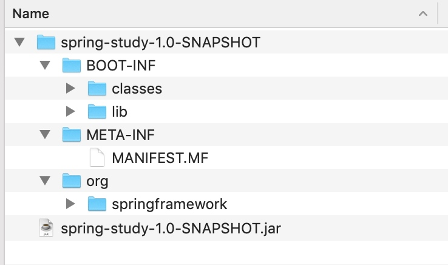
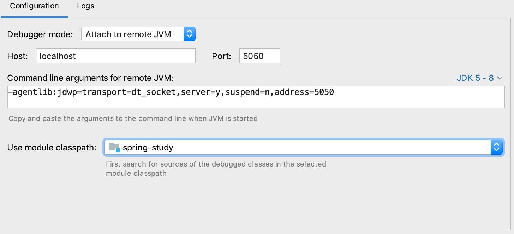
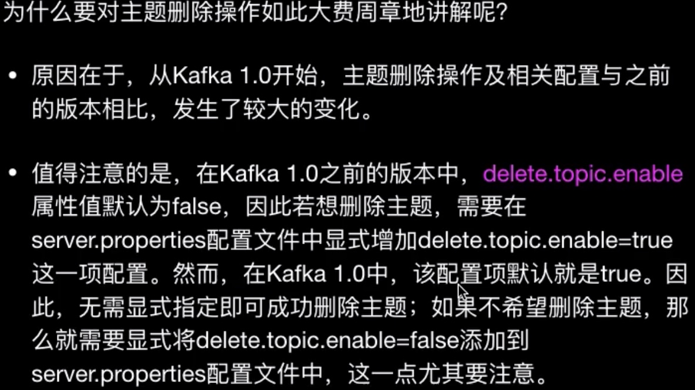
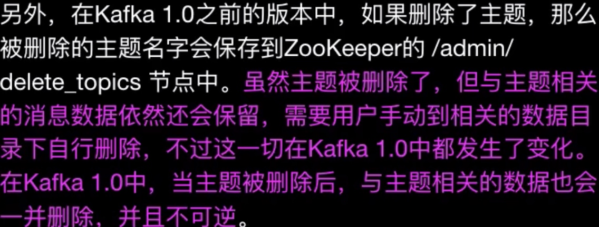
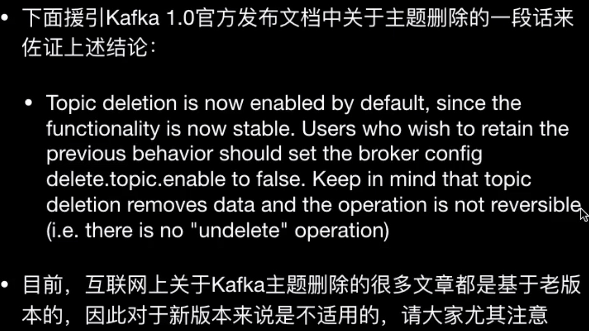
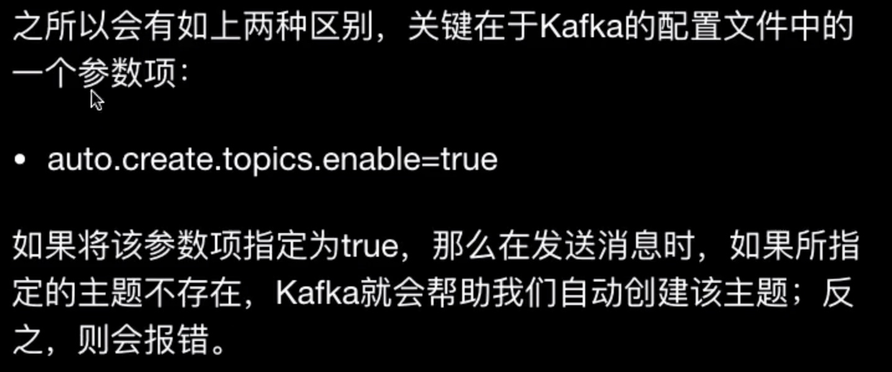
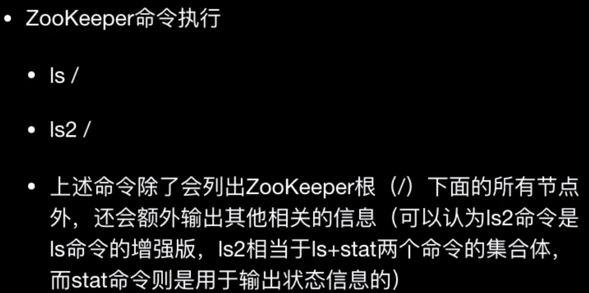
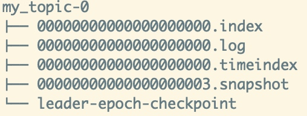
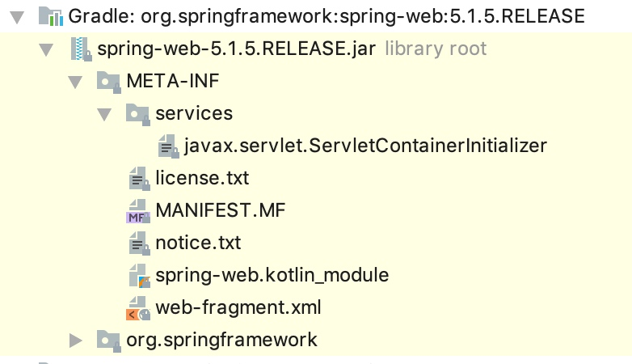
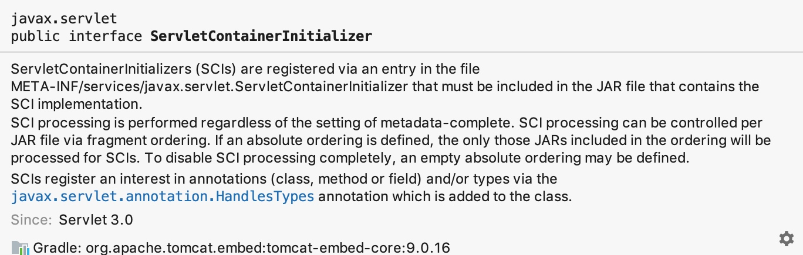

# spring-boot-study
## 一、spring-boot-loader(springboot启动剖析)
### 1、spring-boot应用的打包结构

* BOOT-INF：项目文件
* META-INF：jar包描述文件
* org：spring自定义类加载器相关的文件（为了迎合jar包规范）

### 2、spring-boot自定义类加载器
* 引入spring-boot-loader包

```dependencies {
    compile(
            "org.springframework.boot:spring-boot-starter-web",
            'org.projectlombok:lombok:1.16.8',
            'org.springframework.boot:spring-boot-loader'
    )
```

### 3、JDWP：java debug wire protocol，Java调试协议


```  Documents java -agentlib:jdwp=help
               Java Debugger JDWP Agent Library
               --------------------------------

  (see http://java.sun.com/products/jpda for more information)

jdwp usage: java -agentlib:jdwp=[help]|[<option>=<value>, ...]

Option Name and Value            Description                       Default
---------------------            -----------                       -------
suspend=y|n                      wait on startup?                  y
transport=<name>                 transport spec                    none
address=<listen/attach address>  transport spec                    ""
server=y|n                       listen for debugger?              n
launch=<command line>            run debugger on event             none
onthrow=<exception name>         debug on throw                    none
onuncaught=y|n                   debug on any uncaught?            n
timeout=<timeout value>          for listen/attach in milliseconds n
mutf8=y|n                        output modified utf-8             n
quiet=y|n                        control over terminal messages    n

Obsolete Options
----------------
strict=y|n
stdalloc=y|n

Examples
--------
  - Using sockets connect to a debugger at a specific address:
    java -agentlib:jdwp=transport=dt_socket,address=localhost:8000 ...
  - Using sockets listen for a debugger to attach:
    java -agentlib:jdwp=transport=dt_socket,server=y,suspend=y ...

Notes
-----
  - A timeout value of 0 (the default) is no timeout.

Warnings
--------
  - The older -Xrunjdwp interface can still be used, but will be removed in
    a future release, for example:
        java -Xdebug -Xrunjdwp:[help]|[<option>=<value>, ...]
```
* 本地debug spring-boot应用
```
➜  libs git:(master) java -agentlib:jdwp=transport=dt_socket,server=y,suspend=y,address=5050 -jar spring-study-1.0-SNAPSHOT.jar
Listening for transport dt_socket at address: 5050
```
* idea连接debug


### 4、启动关键类分析
1. org.springframework.core.io.support.SpringFactoriesLoader
加载"META-INF/spring.factories"文件
1. ApplicationContext接口：
2. 
```
public ConfigurableApplicationContext run(String... args) {
		StopWatch stopWatch = new StopWatch(); // 计时器，记录方法和应用执行时间
		stopWatch.start();
		ConfigurableApplicationContext context = null;
		Collection<SpringBootExceptionReporter> exceptionReporters = new ArrayList<>();
		configureHeadlessProperty(); // 表名是服务器端应用，没有鼠标键盘界面
		SpringApplicationRunListeners listeners = getRunListeners(args);
		listeners.starting();
		try {
			ApplicationArguments applicationArguments = new DefaultApplicationArguments(
					args);
			ConfigurableEnvironment environment = prepareEnvironment(listeners,
					applicationArguments);
			configureIgnoreBeanInfo(environment);
			Banner printedBanner = printBanner(environment);
			context = createApplicationContext();
			exceptionReporters = getSpringFactoriesInstances(
					SpringBootExceptionReporter.class,
					new Class[] { ConfigurableApplicationContext.class }, context);
			prepareContext(context, environment, listeners, applicationArguments,
					printedBanner);
			refreshContext(context);
			afterRefresh(context, applicationArguments);
			stopWatch.stop();
			if (this.logStartupInfo) {
				new StartupInfoLogger(this.mainApplicationClass)
						.logStarted(getApplicationLog(), stopWatch);
			}
			listeners.started(context);
			callRunners(context, applicationArguments);
		}
		catch (Throwable ex) {
			handleRunFailure(context, ex, exceptionReporters, listeners);
			throw new IllegalStateException(ex);
		}

		try {
			listeners.running(context);
		}
		catch (Throwable ex) {
			handleRunFailure(context, ex, exceptionReporters, null);
			throw new IllegalStateException(ex);
		}
		return context;
	}
```
## 二、spring-boot模块

### 1、kafka概念

#### 生产者（Producer)

生产者（Producer）顾名思义，生产者就是生产消息的组件，它的主要工作就是源源不断地生产出消息，然后发送给消息队列。生产者可以向消息队列发送各种类型的消息，如狭义的字符串消息，也可以发送二进制消息。生产者是消息队列的数据来源，只有通过生产者持续不断地向消息队列发送消息，消息队列才能不断地处理消息
#### 消费者（Consumer)

消费者的概念也是比较容易理解的。所谓消费者，指的是不断消费（获取）消息的组件，它获取消息的来源就是消息队列（即 Kafka 本身）。換句话说，生产者不断向消息队列发送消息，而消费者则不断从消息队列中获取消息。这里面的消息队列（即 Kafka）则充当了一个中介的角色，连接了生产者与消费者这两大功能组件。正是从这个意义上来说，借助于消息队列，我们实现了生产者系统与消费者系统之间的解耦，使得原本需要两个系统之间有紧密联系的状况変成了两个系统可以各自针对 Kafka 进行编程（只要提前约定好一些契约即可），这可以使得生产者系统完全不需要了解消费者系统的各种信息（比如说消费者系统的地址、端口号、URL、使用的是 REST 接口还是 RPC 等等；反之亦然）。这正是消息队列所提供的另外一个绝佳好处：极大降低了系统之间的耦合度。
#### 代理（Broker)
代理这个概念是消息队列领域中一个常见的概念。Broker 这个单词原本的意思是经纪人，比如说房地产经纪人、股票经纪人等。在消息队列领域中，它指的其实就是消息队列产品本身，比如说在 Kafka 这个领域下，Broker 其实指的就是一台 Kafka Server。换句话说，我们可以将部暑的一台 Kafka Server？看作是一个 Broker，就是这样简单。那么从流程上来说，生产者会将消息发送给 Broker，然后消费者再从 Brokerp 中拉取消息。

#### 主题（Topic）

主题是 Kafka 中一个极为重要的概念。首先，主题是一个逻辑上的概念，它用于从逻辑上来归类与存储消息本身。多个生产者可以向一个 Topic 发送消息，同时也可以有多个消费者消费一个 Topice 中的消息。Topic 还有分区与副本的概念，这两个概念我们将会在后续课程中遇到时详细介绍。现在，你需要理解的是，Topic 与消息这两个概念之间密切相关，Kafka 中的每一条消息都会归属于某一个 Topic，而一个 Topic 下面可以有任意数量的消息。正是借助于 opic 这个逻辑上的概念，Kafka 将各种各样的消息进行了分门别类，使得不同的消息归属于不同的 Topic，这样就可以很好地实现不同系统的生产者可以向同一个 Broker 发送消息，而不同系统的消费者则可以根据 Topic 的名字从 Brokerl 中拉取消息。Topici 是一个字符串。实际上，在上节课中，生产者发送消息时就指定了将消息发送给哪个 Topic，在那个示例中，我们将消息发送给了名为『mytest！的主题，而消费者在拉取消息时也指定了拉取 Topic 名为 mytest』的消息。通过 Topic 这样一个逻辑上的概念，我们就很好地实现了生产者与消费者之间有针对性的发送与拉取。

#### 消息（Record）

消息是整个消息队列中最为基本的一个概念，也是最为原子的一个概念。它指的是生产者发送与消费者拉取的一个原子事物。一个消息需要关联到一个 Topic 上，表示该消息从属于哪个 Topic。消息由一串字节所构成，其中主要由 key 和 value 两部分内容，key 与 value 本质上都是字节数组。在发送消息时，我们可以省略掉 key 部分，而直接使用 valuei 部分。正如上一节的示例那样，生产者在发送消息时，发送的內容是 『Thello world』、『welcome』与『见到你很高兴』。实际上，他们都是消息的 value，即消息真正的内容本身；**key 的主要作用则是根据一定的策略，将此消息发送到指定的分区中，这样就可以确保包含同一key值的消息全部都写入到同一个分区中**。因此，我们可以得出这样一个结论：对于 Kafka 的消息来说，真正的消息内容本身是由 value 所承载的。为了提升消息发送的效率和存储效率，生产者会批量将消息发送给 Broker，并根据相应的压缩算法在发送前对消息进行压缩。

#### 控制器（Controller)

控制器是集群中的概念。每个集群中会选择出一个 Brokerf 担任控制器的角色，控制器是 Kafka 集群的中心。一个 Kafka 集群中，控制器这台 Broker 之外的其他 Brokers 会根据控制器的指挥来实现相应的功能。控制器负责管理 Kafka'分区的状态、管理每个分区的副本状态、监听 Zoo Keeper 中数据的变化并作出相应的反馈等功能。此外，控制器也类似于主从的概念（比如说 MSL 的主从概念），所有的 Broker 都会监听控制器 Leader 的状态，当 Leader 控制器出现问题或是故障时则重新选择新的控制器 Leader，这里面涉及到选举算法的问题。

##### 消费者组（Consumer Group)

这又是 Kafka 中的一个核心概念。消费者组与消费者之间密切相关。在 Kafka 中，多个消费者可以共同构成一个消费者组，而一个消费者只能从属于一个消费者组。消费者组最为重要的一个功能是实现广播与单播的功能。一个消费者组可以确保其所订阅的 Topic 的每个分区只能被从属于该消费者组中的唯一一个消费者所消费；如果不同的消费者组订阅了同个 Topic，那么这些消费者组之间是彼此独立的，不会受到相互的干扰。因此，如果我们希望一条消息可以被多个消费者所消费，那就可以将这些消费者放置到不同的消费者组中这实际上就是**广播**的效果；如果希望一条消息只能被一个消费者所消费，那么就可以将这些消费者放置到同一个消费者组中，这实际上就是**单播**的效果。因此，我们可以将消费者组看作是『逻辑上的订阅者』，而物理上的订阅者则是各个消费者。值得注意的是，消费者组是一个非常、非常、非常重要的概念。很多 Kafka 初学者都会遇到这样一个问题：将系统以集群的形式部署（比如说部署到 3 台机器或是虚拟机上），每台机器的指定代码都是完全一样的，那么在运行时，只会有一台机器会持续不断地收到 Brokerr 中的消息，而其他机器则一条消息也收不到。究其本质，系统部署时采用了集群部署，因此每台机器的代码与配置都是完全一样的；这样，这些机器（消费者）都从属于同一个消费者组，既然从属于同一个消费者组，那么这同一个消费者组中，只会有一个消费者会接收到消息，而其他消费者则完全接收不到任何消息，即单播的效果。这一点尤其值得大家注意。

### 2、spring-boot 整合kafka

* 启动zookeeper命令：
` bin/zookeeper-server-start.sh config/zookeeper.properties `
* 启动kafka命令：
`bin/kafka-server-start.sh config/server.properties `
* 创建主题：
`bin/kafka-topics.sh --create --zookeeper localhost:2181 --replication-factor 1 --partitions 1 --topic my_topic `
* 查看主题(--zookeeper 可以用 --bootstrap-server代替)：
`bin/kafka-topics.sh --list --zookeeper localhost:2181
`或者
`kafka-topics.sh --list --bootstrap-server localhost:9092`
* 删除主题：
`kafka-topics.sh --bootstrap-server localhost:9092 --delete --topic your_topic`
删除主题必须设置配置文件server.properties中配置项delete.topic.enable 设为true（默认已经设置为true），否则这个删除操作将不会起任何作用。





* 查看某个主题详细信息：
`bin/kafka-topics.sh --describe --topic my_topic --zookeeper localhost:2181
`

    * 第一行会显示出所有分区（my_topic 主题的分区数是 1, 即在之前创建主题时所指定的--partitions 1 这个参数所确定的）的一个总结信息；后续的每一行则给出一个分区的信息，如果只有一个分区，那么就只会显示出一行，正如上述输出那样。
    * 第二行表示的信息为：
        * 主题名：my_topic
        * 当前的分区：0 
        * Leader Broker: 0 
        * 副本：0
        * Isr  (In-Sync Replica): 0
* 创建生产者：
`bin/kafka-console-producer.sh --broker-list localhost:9092 --topic my_topic`
* 创建消费者：
`bin/kafka-console-consumer.sh --bootstrap-server localhost:9092 --topic my_topic --group my_group (--from-beginning：启动并拉取历史消息) `



-------
* 那么，这些主题信息是保存在什么地方的呢？
实际上，这些信息都是保存在 Zookeeper 中的。Kafka 是重度依赖于 zookeeper的。zookeeper 保存了 Kafka 所需的元信息以及关于主题、消费者偏移量等诸多信息，下面我们就到 Zookeeper 中査看一下相关的内容
* 连接zookeeper：`./zookeeper-shell.sh localhost:2181`

* 查看kafka主题信息（主题位于：/config/topics目录下）：
`ls /config/topics
[my_topic, __consumer_offsets, your_topic]
ls2 /config/topics
[my_topic, __consumer_offsets, your_topic]
cZxid = 0x11
ctime = Sun Dec 15 12:06:24 CST 2019
mZxid = 0x11
mtime = Sun Dec 15 12:06:24 CST 2019
pZxid = 0xa4
cversion = 3
dataVersion = 0
aclVersion = 0
ephemeralOwner = 0x0
dataLength = 0
numChildren = 3
`

### 3、kafka分区
* 分区的概念：
    1. 每个分区都是一个有序、不可变的消息序列，后续新来的消息会源源不断地、持续追加到分区的后面，这相当于一种结构化的提交日志（类似于 Git 的提交日志）
    2. 分区中的每一条消息都会被分配一个连续的 id 值（即 offset），该值用于唯一标识分区中的每一条消息。
* 分区的重要作用：
    1. 分区中的消息数据是存储在日志文件中的，而且同一分区中的消息数据是按照发送顺序严格有序的。分区在逻辑上对应一个日志，当生产者将消息写入分区中时，实际上是写到了分区所对应的日志当中。而日志可以看作是一种逻辑上的概念，它对应于磁盘上的一个目录。一个日志文件由多个 Segment（段）来构成，每个 Segment 对应于ー个索引文件与ー个日志文件。

    2. 借助于分区，我们可以实现 Kafka Servers 的水平扩展。对于一台机器来说，无论是物理机还是虚拟机，其运行能力总归是有上限的。当一台机器到达其能力上限时就无法再扩展了，即垂直扩展能力总是受到硬件制约的。通过使用分区，我们可以将一个主题中的消息分散到不同的 Kafka Server 上（这里需要使用 Kafka 集群），这样当机器的能力不足时，我们只需要添加机器就可以了，在新的机器上创建新的分区，这样理论上就可以实现无限的水平扩展能力。

    3. 分区还可以实现并行处理能力，向一个主题所发送的消息会发送给该主题所拥有的不同的分区中，这样消息就可以实现并行发送与处理，由多个分区来接收所发送的消息。

* Segment（段）:
    1. 一个分区（partition）是由一系列有序、不可变的消息所构成的。一个 partition 中的消息数量可能会非常多，因此显然不能将所有消息都保存到一个文件当中。因此，类似于log4j的rolling log，当 partition 中的消息数量增长到一定程度之后，消息文件会进行切割，新的消息会被写到一个新的文件当中，当新的文件增长到定程度后，新的消息又会被写到另一个新的文件当中，以此类推；这一个个新的数据文件我们就称之为segment（段）。
    2. 因此，一个 partition 在物理上是由一个或者多个 segment 所构成的。每个 segment 中则保存了真实的消息数据。

* 关于 partiton 与 segment 之间的关系

    1. 每个 partition 都相当于ー个大型文件被分配到多个大小相等的 segment 数据文件中，每个 segment 中的消息数量未必相等（这与消息大小有着紧密的关系，不同的消息所占据的磁盘空间显然是不一样的），这个特点使得老的 segment 文件可以很容易就被删除掉，有助于提升磁盘的利用效率。

    2. 每个 partition 只需要支持顺序读写即可，segment文件的生命周期是由 Kafka Servers 的配置参数所決定的。比如说，server.propertles 文件中的参数项 log.retention.hours=168 就表示 7 天后删除老的消息文件。
* 关于分区目录中的 4 个文件的含义与作用


    1. 00000000000000000000.index：它是 segment 文件的素引文件，它与接下来我们要介绍的 00000000000.109 数据文件是成对出现的。后缀，index 就表示这是个索引文件。

    2. 00000000000000000000.log：它是 segment 文件的数据文件，用于存储实际的消息。该文件是二进制格式的。segment 文件的命名规则是 partition 全局的第一个 segment 从开始，后孌每个 segment 文件名为上ー个 segment 文件最后一条消息的 offset 值。没有数字则用填充。由于这里的主题的消息数量较少，因此只有一个数据文件。

    3. 00000000000000000000.timeindex：该文件是一个基于消息日期的索引文件，主要用途是在一些根据日期或是时间来寻找消息的场景下使用，此外在基于时间的日志 rolling 或是基于时间的日志保留策略等情况下也会使用。实际上，该文件是在 Kafka 较新的版本中才增加的，老版本 Kafka 是没有该文件的。它是对 *.index 文件的一个有益补充。 *.index 文件是基于偏移量的索引文件，而 *.timeindex 则是基于时间戳的索引文件。
    4. leader-epoch-checkpoint：是 leaders 的一个缓存文件。实际上，它是与 Kafkas 的 HW (High Water）与 LEO (Log End Offset）相关的一个重要文件。

## spring-boot整合spring-mvc原理
### 1、spring-web包结构

* servlet3.0规范接口：`javax.servlet.ServletContainerInitializer`

* ServletContainerInitalizers(SCIs)是通过 `META-INF/services/javax.servlet.ServletContainerInitializer` 文件中的一个条目来注册，这个文件必须被包含在JAR文件中，且这个JAR文件包含了SCI的实现。
* 无论元数据是否设置完成，都会执行SCI处理。SCI处理可以通过可以通过片段的顺序来控制每个JAR文件。如果定义了绝对顺序，那么将仅对包含在顺序中的JAR文件做SCI处理。为了完全关闭SCI处理，可以定义一个空的绝对顺序。SCIs通过添加 `javax.servlet.annotation.HandlesTypes` 注解到这个类中，来注册感兴趣的注解（类、方法或者字段）和/或类型。
