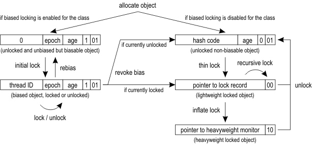

# Synchronization
> https://wiki.openjdk.java.net/display/HotSpot/Synchronization

## 同步和对象锁
由Thomas Kotzmann和Christian Wimmer编写
Java编程语言的主要优点是它对多线程程序的内置支持。可以锁定在多个线程之间共享的对象，以便同步其访问。Java提供了用于指定关键代码区域的原语，这些关键代码区域作用于共享对象，并且可以在同一时刻由一个线程执行。第一个线程进入这个区域锁定共享对象。当第二个线程即将进入同一块区域时，它必须等待，直到第一个线程再次将对象解锁。

在Java HotSpot™VM中，每个对象前面都有一个类指针和一个标题字。标题字，用于存储身份的哈希码和年龄，以用于分代垃圾回收，标题字还用于实现轻量级锁约束[Agesen99, Bacon98]。下图展示了标题字的布局以及不同对象状态的表示。

图示的右边展示了标准的锁定过程。只要对象没有被锁定，最后两个比特位的值是01。当方法在对象上同步时，标题字和指向该对象的指针将被存储在当前的栈帧内的锁记录中。然后，VM尝试通过cas操作在对象标题字中安装只想锁记录的指针。如果安装成功，则当前线程随后拥有该锁。由于锁记录总在标题字的边界处对齐，因此标题字的最后两位是00，并且标识这对象为被锁定。